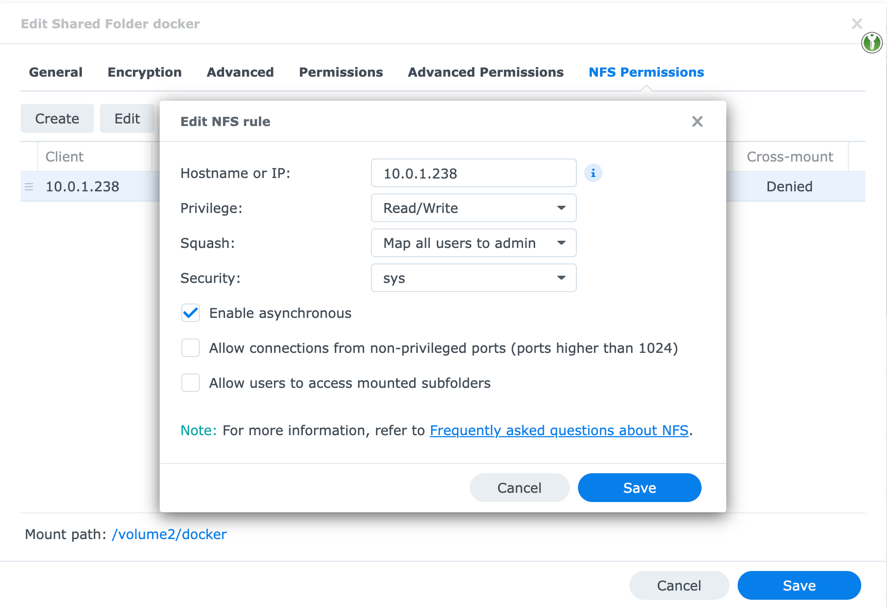

# [Prereq] Vytvoření NFS share na Synology NAS
## Povolení NFS protokolu
Nejprve je potřeba povolit NFS protokol na úrovni celého NAS **Control panel -> File Services -> NFS -> Enable NFS service**


## Nastavení oprávnění
U vytvořené sdíléné složky je potřeba nastavit **NFS Permissions**

**Control panel -> Shared folder -> <název sdílené složky> -> Edit -> NFS Permissions -> Create**


| Nastavení      | Hodnota                                                                                                      |
| ---------------|--------------------------------------------------------------------------------------------------------------|
| Hostname or IP | IP adresa serveru, ke kterému NFS share připojíš                                                             |
| Privilage      | Oprávnění ke sdílenému disku                                                                                 |
| Squash         | Namapování oprávnění na skupiny nebo uživatele                                                               |
| Security       | AUTH_SYS - namapování na UID a GUID - musí se shodovat s UID a GUID na serveru, pokud nechci používat Squash |

# Instalace NFS klienta na Rocky Linux
```bash
sudo yum install nfs-utils
```

# Připojení NFS disku
## Jednorázové připojení
```bash
# sudo mount -t nfs [Synology NAS IP address]:[mount path of shared folder] /[mount point on NFS client]
sudo mount -t nfs nas.stepan.tech:/volume2/docker /mnt/docker
```

## Automatické připojení i po restartu
```bash
sudo vi /etc/fstab
```

**Soubor: /etc/fstab**
```bash
# <file system>                 <dir>       <type>   <options>   <dump>	<pass>
nas.stepan.tech:/volume2/docker /mnt/doceker  nfs      defaults    0       0
```

## Ověření funkčnosti
Pomocí příkazu **df** si vypíš seznam připojených disků

